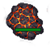
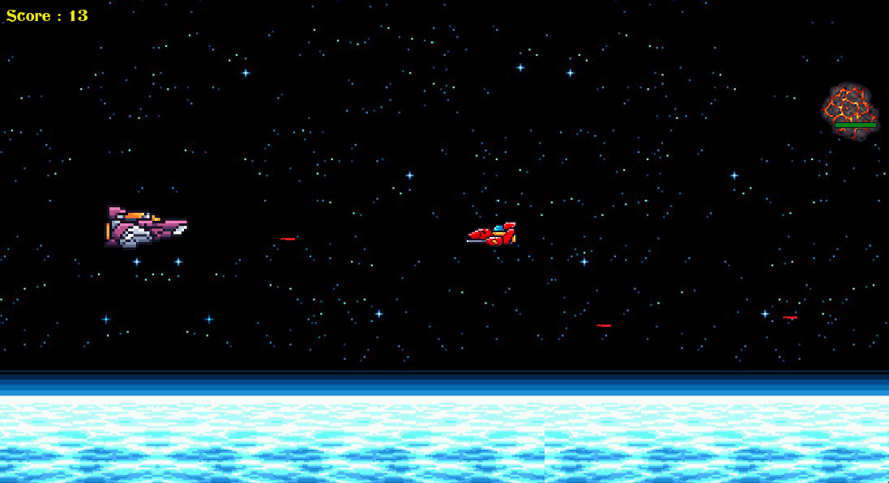
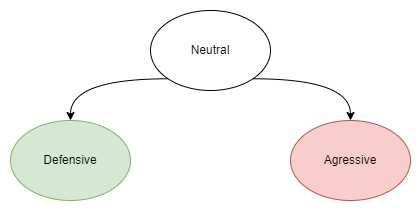

# Pygame - Galactic war

## Presentation
This is a mini game made as part of a school project in mathematical modelling course. The goal of 
this game is inspired by asteroids game, you control a spaceship and for scoring you have to avoid or destroy with your rockets
asteroids and enemy's spaceships.




This game was built thanks to python with pygame lib.
___
Here is a preview of the game :


## Controls

- directional keypad for moving
- w to shoot

## Bot

A bot was made based on a state machine, to control the main spaceship.



- defensive : try to avoid an object
- agressive : move aligned to the object and shoots

## Setup the game

```shell
$ pip install -r requirements.txt

# with bot
$ python game.py -bot

# otherwise
$ python game.py
```

